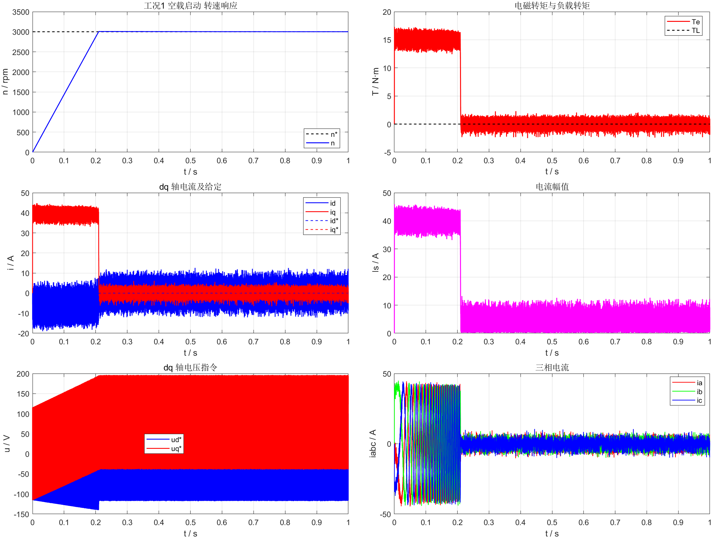
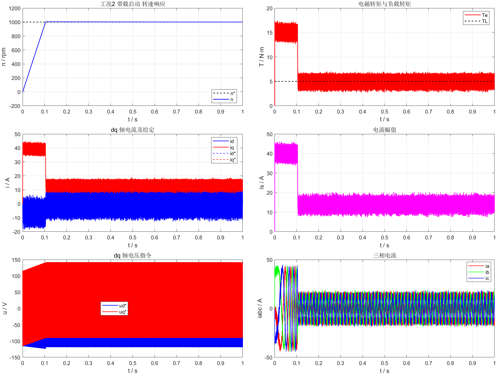
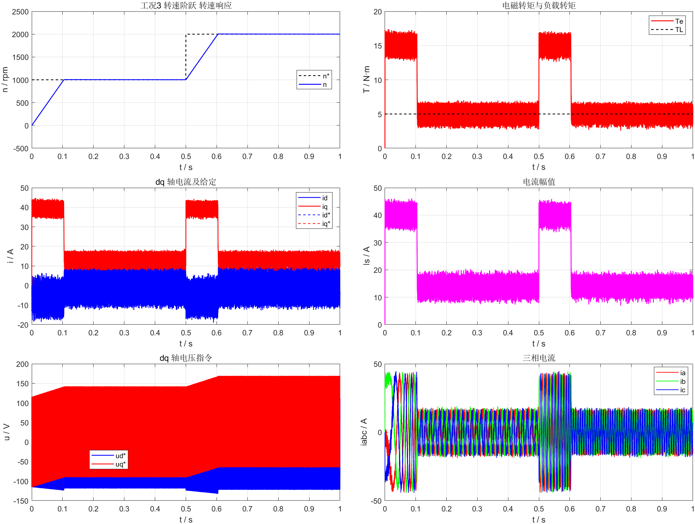
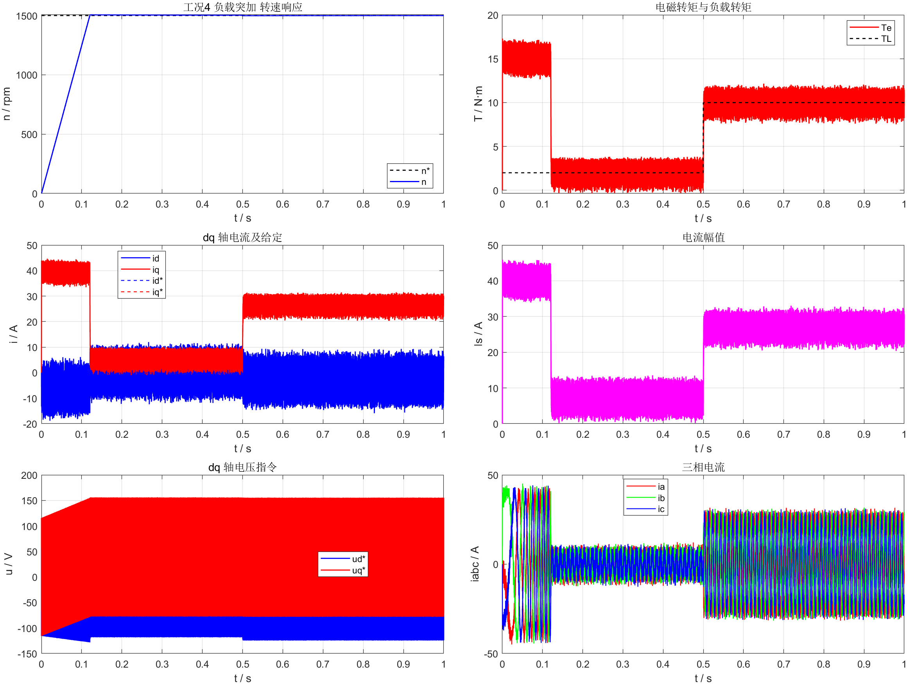
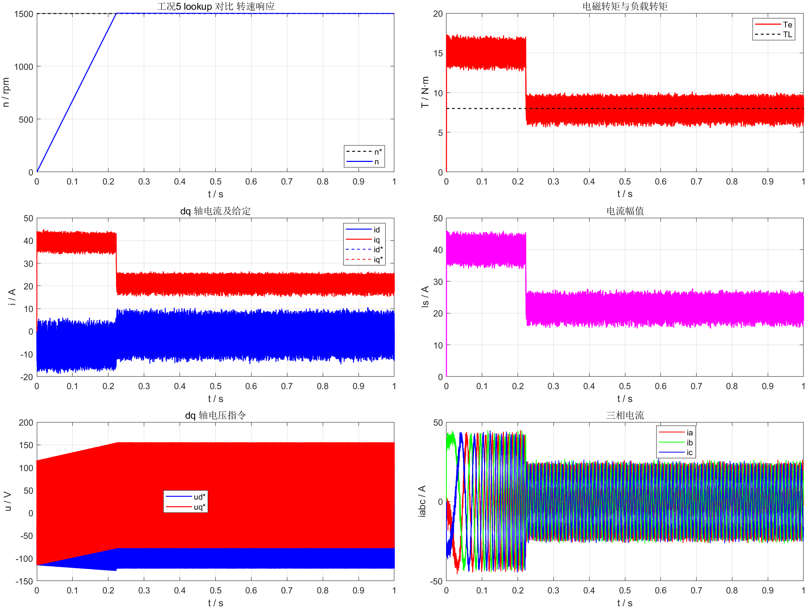
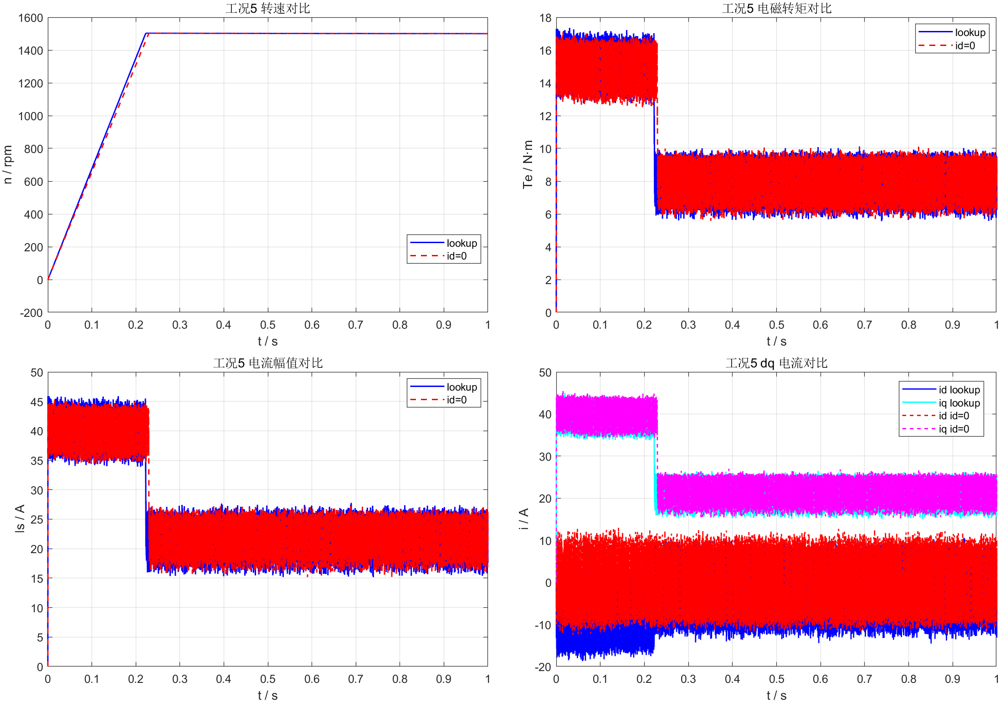
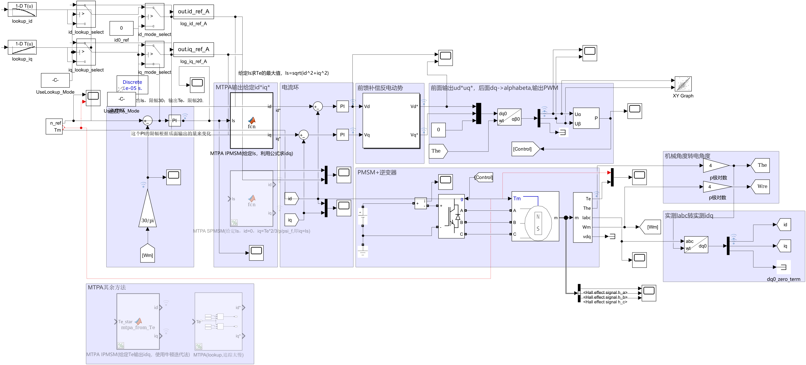
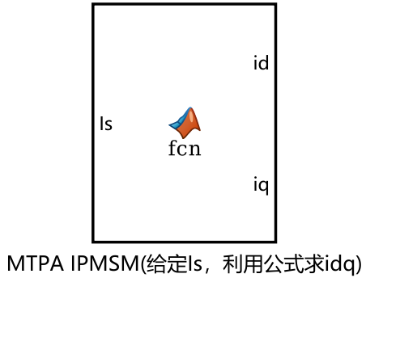

# 基于 MTPA 的 PMSM 双闭环调速系统课程设计 / Course Design for PMSM Double-Closed-Loop Speed Control Based on MTPA

本仓库公开保存本次课程设计的最终交付物，包括可运行的 Simulink 模型、`scenario.mat`、MTPA 查表文件、按工况导出的 `.mat` 数据、中文课程报告、工况结果图片和答辩 PPT。

## 目录说明

- `仿真文件/`
  - `PMSM_MTPA.slx`：最终可运行的 Simulink 主模型
  - `scenario.mat`：Signal Editor 使用的 5 个工况场景
  - `mtpa_lookup_tables.mat`：lookup 模式使用的 MTPA 查表数据
  - `PMSM双闭环调速系统MTPA课程设计任务书.docx`：原始任务书
  - `工具/build_pmsm_taskbook_assets.m`：批量重建工况、查表、图片和工况数据的脚本
  - `工具/generate_pmsm_support_files.m`：早期支持脚本，保留作参考
  - `工况数据/`：`case1` 到 `case5` 的 `.mat` 数据，以及 `taskbook_metrics.csv/.mat`
- `课程报告/`
  - `课程设计报告_PMSM_MTPA.docx`：中文在前、英文在后的课程设计报告
  - `图片/`：报告中引用的关键模型图和仿真波形
- `答辩PPT/`
  - `永磁电机MTPA控制.pptx`：最终答辩 PPT

## 工况设置

本次最终交付采用以下 5 个工况：

1. `工况1 空载启动`：`3000 r/min`，`TL = 0 N·m`
2. `工况2 带载启动`：`1000 r/min`，`TL = 5 N·m`
3. `工况3 转速阶跃`：`0.5 s` 时 `1000 -> 2000 r/min`，`TL = 5 N·m`
4. `工况4 负载突加`：`1500 r/min`，`0.5 s` 时 `TL = 2 -> 10 N·m`
5. `工况5 lookup 对比`：`1500 r/min`，`TL = 8 N·m`，分别比较 `lookup` 与 `id=0`

## 本次修复与补全

- 重新生成了 `scenario.mat`
- 重新生成了 `mtpa_lookup_tables.mat`
- 修复了 Signal Editor 第二路负载信号未接入 PMSM `Tm` 端口的问题
- 在模型中加入了 `lookup / id=0` 选择逻辑
- 将速度环限幅和 lookup 查表上限统一提升到 `40 A`，以满足任务书工况 4 的 `2 -> 10 N·m` 负载突加要求
- 导出了按工况分类的 `.mat` 数据、汇总指标和报告图片

## 验证结果摘要

`仿真文件/工况数据/taskbook_metrics.csv` 中的主要结果如下：

- `工况1`：稳态转速约 `3001.02 r/min`，稳态转矩约 `0 N·m`
- `工况2`：稳态转速约 `1000.53 r/min`，稳态转矩约 `5.00 N·m`
- `工况3`：90% 上升时间约 `0.093 s`，超调约 `4.47 r/min`
- `工况4`：负载 `2 -> 10 N·m` 时，稳态转速约 `1499.57 r/min`，稳态转矩约 `10.00 N·m`
- `工况5`：在相同 `8 N·m` 转矩需求下，`lookup` 模式稳态电流幅值约 `21.88 A`，略低于 `id=0` 模式的 `21.97 A`

## 工况结果图片

### 工况1 空载启动

### 工况2 带载启动

### 工况3 转速阶跃

### 工况4 负载突加

### 工况5 lookup 对比

### 工况5 lookup 与 id=0 对比

## 模型示意图

### 顶层模型

### MTPA 电流给定模块

## 说明

课程报告 DOCX 已重新生成并做了结构校验。由于当前机器缺少可直接工作的 LibreOffice 渲染链路，未能完成标准 `DOCX -> PNG` 页面渲染验收；但报告文件、图片资源、表格和内嵌图片关系均已生成并同步上传。
